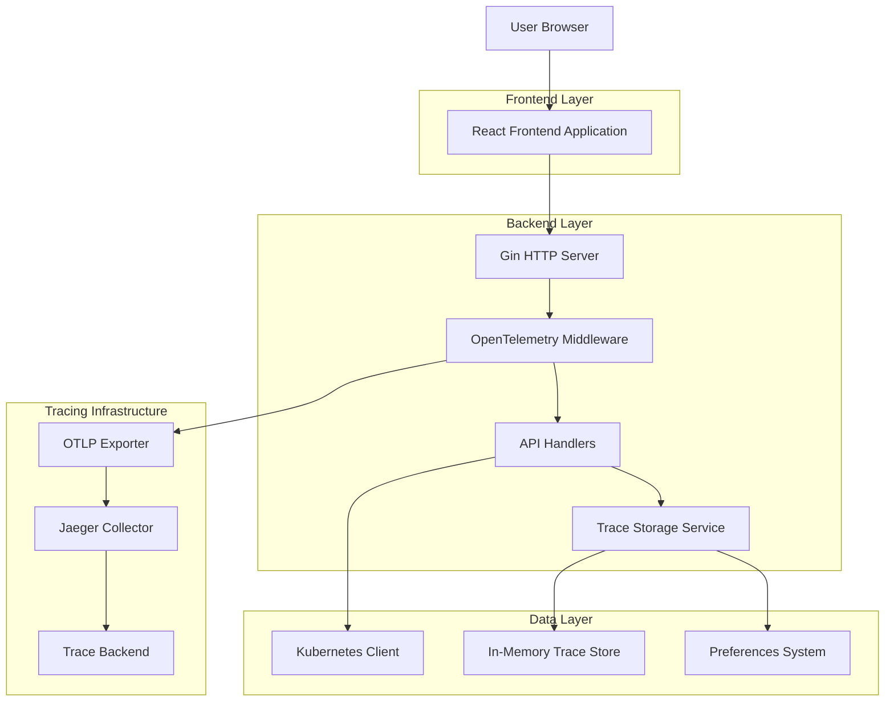
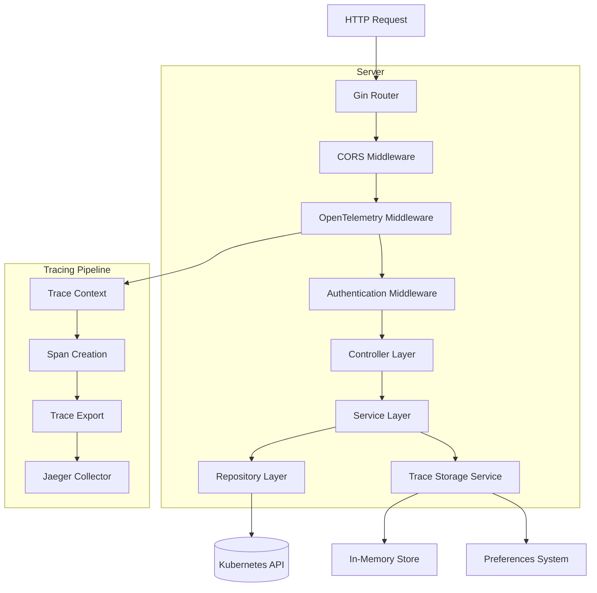
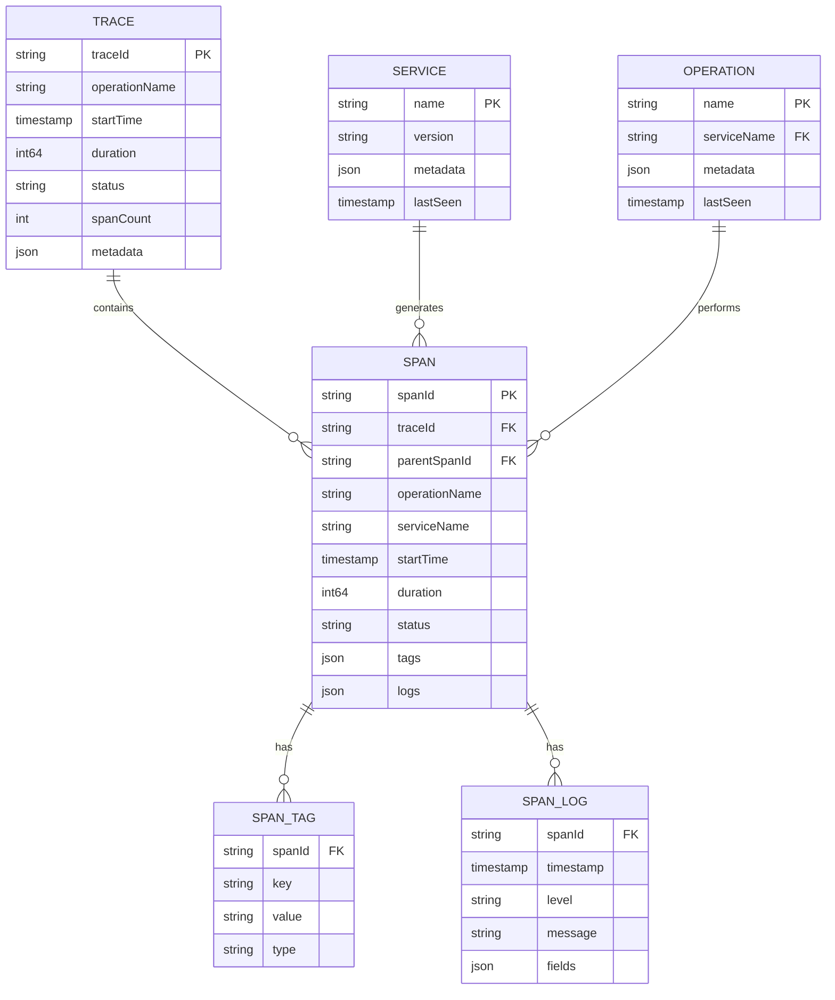

## 1. Architecture design



## 2. Technology Description

* Frontend: React\@18 + TypeScript + tailwindcss\@3 + vite + recharts (for trace visualization)

* Backend: Go + Gin + OpenTelemetry Go SDK + Jaeger Client

* Tracing: OpenTelemetry + Jaeger (embedded collector)

* Storage: In-memory trace store + existing preferences system

* Visualization: D3.js for service maps, Timeline components for trace details

## 3. Route definitions

| Route               | Purpose                                                   |
| ------------------- | --------------------------------------------------------- |
| /traces             | Main traces dashboard with overview and filtering         |
| /traces/:traceId    | Detailed view of individual trace with timeline           |
| /traces/service-map | Interactive service topology and dependency visualization |
| /traces/settings    | Tracing configuration and preferences management          |
| /api/traces         | REST API for trace data retrieval and filtering           |
| /api/traces/export  | Trace data export functionality                           |
| /api/tracing/config | Tracing configuration management                          |

## 4. API definitions

### 4.1 Core API

Trace retrieval and filtering

```
GET /api/traces
```

Request:

| Param Name  | Param Type | isRequired | Description                                       |
| ----------- | ---------- | ---------- | ------------------------------------------------- |
| service     | string     | false      | Filter traces by service name                     |
| operation   | string     | false      | Filter traces by operation name                   |
| startTime   | string     | false      | Start time for trace search (ISO 8601)            |
| endTime     | string     | false      | End time for trace search (ISO 8601)              |
| minDuration | string     | false      | Minimum trace duration filter                     |
| maxDuration | string     | false      | Maximum trace duration filter                     |
| status      | string     | false      | Filter by trace status (success, error)           |
| limit       | number     | false      | Maximum number of traces to return (default: 100) |
| offset      | number     | false      | Pagination offset (default: 0)                    |

Response:

| Param Name | Param Type | Description                       |
| ---------- | ---------- | --------------------------------- |
| traces     | array      | Array of trace objects            |
| total      | number     | Total number of matching traces   |
| hasMore    | boolean    | Whether more traces are available |

Example Response:

```json
{
  "traces": [
    {
      "traceId": "abc123def456",
      "operationName": "GET /api/pods",
      "startTime": "2024-01-15T10:30:00Z",
      "duration": 150000,
      "services": ["kube-dash-api", "kubernetes-api"],
      "status": "success",
      "spanCount": 8
    }
  ],
  "total": 1,
  "hasMore": false
}
```

Individual trace details

```
GET /api/traces/:traceId
```

Response:

| Param Name | Param Type | Description                                    |
| ---------- | ---------- | ---------------------------------------------- |
| trace      | object     | Complete trace object with all spans           |
| spans      | array      | Array of span objects with timing and metadata |

Service map data

```
GET /api/traces/service-map
```

Request:

| Param Name | Param Type | isRequired | Description                                   |
| ---------- | ---------- | ---------- | --------------------------------------------- |
| timeRange  | string     | false      | Time range for service map data (1h, 6h, 24h) |

Response:

| Param Name  | Param Type | Description                                   |
| ----------- | ---------- | --------------------------------------------- |
| services    | array      | Array of service nodes with metrics           |
| connections | array      | Array of service connections with call counts |

Tracing configuration

```
GET /api/tracing/config
PUT /api/tracing/config
```

Request (PUT):

| Param Name     | Param Type | isRequired | Description                       |
| -------------- | ---------- | ---------- | --------------------------------- |
| samplingRate   | number     | true       | Trace sampling rate (0.0 to 1.0)  |
| maxTraces      | number     | true       | Maximum traces to store in memory |
| retentionHours | number     | true       | Trace retention period in hours   |

## 5. Server architecture diagram



## 6. Data model

### 6.1 Data model definition



### 6.2 Data Definition Language

Trace Storage Structures (Go)

```go
// Trace represents a complete distributed trace
type Trace struct {
    TraceID       string            `json:"traceId"`
    OperationName string            `json:"operationName"`
    StartTime     time.Time         `json:"startTime"`
    Duration      time.Duration     `json:"duration"`
    Status        string            `json:"status"`
    Services      []string          `json:"services"`
    SpanCount     int               `json:"spanCount"`
    Spans         []Span            `json:"spans"`
    Tags          map[string]string `json:"tags"`
}

// Span represents an individual operation within a trace
type Span struct {
    SpanID        string            `json:"spanId"`
    TraceID       string            `json:"traceId"`
    ParentSpanID  string            `json:"parentSpanId,omitempty"`
    OperationName string            `json:"operationName"`
    ServiceName   string            `json:"serviceName"`
    StartTime     time.Time         `json:"startTime"`
    Duration      time.Duration     `json:"duration"`
    Status        string            `json:"status"`
    Tags          map[string]string `json:"tags"`
    Logs          []SpanLog         `json:"logs"`
}

// SpanLog represents a log entry within a span
type SpanLog struct {
    Timestamp time.Time              `json:"timestamp"`
    Level     string                 `json:"level"`
    Message   string                 `json:"message"`
    Fields    map[string]interface{} `json:"fields"`
}

// ServiceMapNode represents a service in the service map
type ServiceMapNode struct {
    Name         string  `json:"name"`
    RequestCount int64   `json:"requestCount"`
    ErrorCount   int64   `json:"errorCount"`
    AvgLatency   float64 `json:"avgLatency"`
    P95Latency   float64 `json:"p95Latency"`
    Health       string  `json:"health"`
}

// ServiceMapEdge represents a connection between services
type ServiceMapEdge struct {
    Source       string  `json:"source"`
    Target       string  `json:"target"`
    RequestCount int64   `json:"requestCount"`
    ErrorCount   int64   `json:"errorCount"`
    AvgLatency   float64 `json:"avgLatency"`
}

// TracingConfig represents tracing configuration
type TracingConfig struct {
    SamplingRate    float64 `json:"samplingRate"`
    MaxTraces       int     `json:"maxTraces"`
    RetentionHours  int     `json:"retentionHours"`
    ExportEnabled   bool    `json:"exportEnabled"`
    JaegerEndpoint  string  `json:"jaegerEndpoint"`
}
```

In-Memory Storage Implementation

```go
// TraceStore manages in-memory trace storage
type TraceStore struct {
    traces    map[string]*Trace
    services  map[string]*ServiceMapNode
    config    *TracingConfig
    mutex     sync.RWMutex
    retention time.Duration
}

// Initialize trace store
func NewTraceStore(config *TracingConfig) *TraceStore {
    return &TraceStore{
        traces:    make(map[string]*Trace),
        services:  make(map[string]*ServiceMapNode),
        config:    config,
        retention: time.Duration(config.RetentionHours) * time.Hour,
    }
}

// Store trace data
func (ts *TraceStore) StoreTrace(trace *Trace) error {
    ts.mutex.Lock()
    defer ts.mutex.Unlock()
    
    ts.traces[trace.TraceID] = trace
    ts.updateServiceMap(trace)
    ts.cleanupOldTraces()
    
    return nil
}
```

