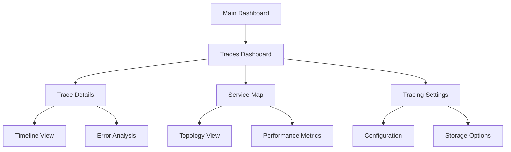

## 1. Product Overview
Implement comprehensive OpenTelemetry tracing instrumentation in kube-dash to provide complete visibility into API calls and service communications within Kubernetes clusters. This feature enables developers and operators to monitor, debug, and optimize application performance through detailed trace visualization.

The tracing system captures all backend API calls, internal service communications, and Kubernetes operations, presenting them in an intuitive UI with hierarchical service maps, performance metrics, and error tracking capabilities.

## 2. Core Features

### 2.1 User Roles
| Role | Registration Method | Core Permissions |
|------|---------------------|------------------|
| Cluster Administrator | Existing kube-dash authentication | Full access to all traces, configuration management |
| Developer | Existing kube-dash authentication | View traces for accessible namespaces, basic filtering |
| Operator | Existing kube-dash authentication | View traces, performance metrics, error analysis |

### 2.2 Feature Module
Our OpenTelemetry tracing requirements consist of the following main pages:
1. **Traces Dashboard**: trace overview, service map, performance summary, recent activity feed
2. **Trace Details**: individual trace timeline, span hierarchy, request flow, error details
3. **Service Map**: service topology, dependency visualization, health indicators, performance metrics
4. **Tracing Settings**: trace configuration, sampling rates, storage preferences, export options

### 2.3 Page Details
| Page Name | Module Name | Feature description |
|-----------|-------------|---------------------|
| Traces Dashboard | Trace Overview | Display recent traces with filtering by service, operation, status, and time range |
| Traces Dashboard | Service Map | Visualize service dependencies and communication patterns with performance indicators |
| Traces Dashboard | Performance Summary | Show key metrics including latency percentiles, error rates, and throughput |
| Traces Dashboard | Activity Feed | List recent trace events with quick access to detailed views |
| Trace Details | Timeline View | Display trace spans in chronological order with duration bars and nesting |
| Trace Details | Span Hierarchy | Show parent-child relationships between spans with expandable tree structure |
| Trace Details | Request Flow | Visualize request path through services with timing and status information |
| Trace Details | Error Analysis | Highlight errors, exceptions, and performance bottlenecks within the trace |
| Service Map | Topology View | Interactive graph showing service connections with real-time health status |
| Service Map | Dependency Analysis | Identify critical paths and potential failure points in service architecture |
| Service Map | Performance Metrics | Display latency, throughput, and error rates for each service connection |
| Tracing Settings | Configuration | Manage trace sampling rates, retention policies, and collection preferences |
| Tracing Settings | Storage Options | Configure trace storage backend and data export settings |
| Tracing Settings | Filter Management | Create and manage custom trace filters and alerting rules |

## 3. Core Process
**Administrator Flow:**
Administrators access the tracing dashboard from the main navigation, configure sampling rates and storage preferences in settings, monitor overall system performance through the service map, and investigate issues using detailed trace analysis.

**Developer Flow:**
Developers navigate to traces dashboard to monitor their applications, filter traces by service or namespace, drill down into specific traces to debug issues, and analyze performance patterns using the service map.

**Operator Flow:**
Operators use the dashboard for real-time monitoring, set up alerts for performance degradation, investigate incidents through trace details, and track system health via service topology.

## 4. User Interface Design
### 4.1 Design Style
- Primary colors: Blue (#3B82F6) for traces, Green (#10B981) for healthy services, Red (#EF4444) for errors
- Secondary colors: Gray (#6B7280) for inactive elements, Orange (#F59E0B) for warnings
- Button style: Rounded corners with subtle shadows, consistent with existing kube-dash design
- Font: Inter or system default, 14px for body text, 16px for headers
- Layout style: Card-based design with clean spacing, integrated sidebar navigation
- Icons: Lucide icons for consistency, custom trace-specific icons for spans and services

### 4.2 Page Design Overview
| Page Name | Module Name | UI Elements |
|-----------|-------------|-------------|
| Traces Dashboard | Trace Overview | Filter bar with dropdowns, sortable table with trace IDs, status badges, duration indicators |
| Traces Dashboard | Service Map | Interactive SVG graph with nodes and edges, zoom controls, legend panel |
| Traces Dashboard | Performance Summary | Metric cards with charts, percentile graphs, trend indicators |
| Trace Details | Timeline View | Horizontal timeline with nested spans, color-coded by service, hover tooltips |
| Trace Details | Span Hierarchy | Collapsible tree structure, indented spans, duration bars, status icons |
| Service Map | Topology View | Force-directed graph layout, service nodes with health indicators, connection lines |
| Tracing Settings | Configuration | Form inputs for sampling rates, toggle switches, validation feedback |

### 4.3 Responsiveness
Desktop-first design with mobile-adaptive layouts. Touch interaction optimization for service map navigation and trace timeline scrubbing. Responsive breakpoints at 768px and 1024px for optimal viewing across devices.