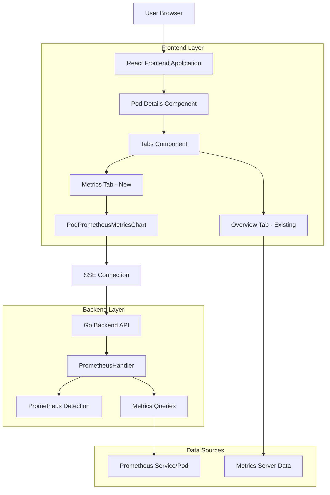
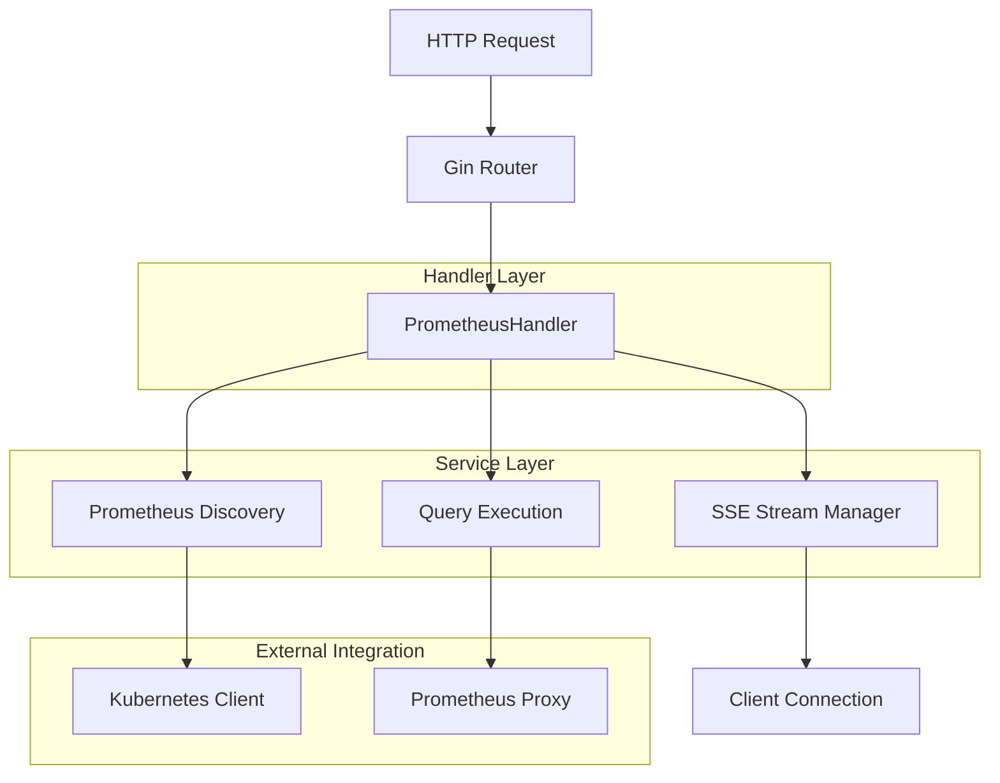
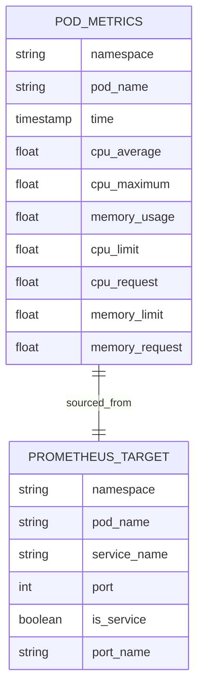

# Pod Metrics Tab - Technical Architecture Document

## 1. Architecture Design



## 2. Technology Description

* Frontend: React\@18 + TypeScript + TailwindCSS + Recharts (for visualization)

* Backend: Go + Gin framework + Kubernetes client-go

* Data Sources: Prometheus (new metrics) + Kubernetes Metrics Server (existing)

* Communication: Server-Sent Events (SSE) for real-time updates

## 3. Route Definitions

| Route                                         | Purpose                                                                         |
| --------------------------------------------- | ------------------------------------------------------------------------------- |
| /details/pods/:namespace/:name                | Pod details page with enhanced tab navigation including conditional Metrics tab |
| /api/metrics/availability                     | Check Prometheus availability in cluster                                        |
| /api/metrics/pods/:namespace/:name/prometheus | SSE endpoint for Prometheus-based pod metrics                                   |

## 4. API Definitions

### 4.1 Core API

**Prometheus Availability Check**

```
GET /api/metrics/availability?config={configId}&cluster={clusterId}
```

Response:

| Param Name | Param Type | Description                                |
| ---------- | ---------- | ------------------------------------------ |
| installed  | boolean    | Whether Prometheus is detected in cluster  |
| reachable  | boolean    | Whether Prometheus is accessible           |
| namespace  | string     | Prometheus deployment namespace            |
| pod        | string     | Prometheus pod name (if pod-based)         |
| service    | string     | Prometheus service name (if service-based) |
| port       | number     | Prometheus port number                     |

Example Response:

```json
{
  "installed": true,
  "reachable": true,
  "namespace": "monitoring",
  "pod": "prometheus-server-abc123",
  "port": 9090
}
```

**Pod Prometheus Metrics Stream**

```
GET /api/metrics/pods/{namespace}/{name}/prometheus?config={configId}&cluster={clusterId}&range=15m&step=15s
```

SSE Response Format:

```json
{
  "series": [
    {
      "metric": "cpu_average",
      "points": [
        {"t": 1692123456, "v": 250.5}
      ]
    },
    {
      "metric": "cpu_maximum", 
      "points": [
        {"t": 1692123456, "v": 450.2}
      ]
    },
    {
      "metric": "memory_usage",
      "points": [
        {"t": 1692123456, "v": 1073741824}
      ]
    }
  ],
  "limits": {
    "cpu": 1000,
    "memory": 2147483648
  },
  "requests": {
    "cpu": 500,
    "memory": 1073741824
  }
}
```

## 5. Server Architecture Diagram



## 6. Data Model

### 6.1 Data Model Definition



### 6.2 Component Structure

**Frontend Components:**

```typescript
// New component for Prometheus-based metrics
interface PodPrometheusMetricsProps {
  namespace: string;
  podName: string;
  configName: string;
  clusterName: string;
}

// Enhanced tab structure
interface TabConfig {
  value: string;
  label: string;
  visible: boolean;
  component: React.ComponentType;
}

// Metrics data structure
interface PrometheusMetrics {
  series: MetricSeries[];
  limits: ResourceLimits;
  requests: ResourceRequests;
}

interface MetricSeries {
  metric: string;
  points: MetricPoint[];
}

interface MetricPoint {
  t: number; // timestamp
  v: number; // value
}
```

**Backend Structures:**

```go
// Enhanced Prometheus queries for pod metrics
type PodMetricsQueries struct {
    CPUAverage string
    CPUMaximum string
    MemoryUsage string
}

// Metrics response structure
type PrometheusMetricsResponse struct {
    Series   []MetricSeries   `json:"series"`
    Limits   ResourceLimits   `json:"limits"`
    Requests ResourceRequests `json:"requests"`
}

type MetricSeries struct {
    Metric string        `json:"metric"`
    Points []MetricPoint `json:"points"`
}

type MetricPoint struct {
    Timestamp int64   `json:"t"`
    Value     float64 `json:"v"`
}
```

## 7. Implementation Plan

### 7.1 Backend Implementation

1. **Extend PrometheusHandler** (`internal/api/handlers/metrics/prometheus.go`):

   * Add new endpoint for pod-specific Prometheus metrics

   * Implement CPU average/maximum queries

   * Add memory usage queries with proper container filtering

   * Extract pod resource limits/requests from Kubernetes API

2. **Query Implementation**:

   ```go
   // CPU Average Query
   qCPUAvg := fmt.Sprintf(`avg(rate(container_cpu_usage_seconds_total{namespace=~"%s",endpoint="https-metrics",pod=~"%s",image!="", container!="POD"}[2m])* 1000)`, namespace, podName)

   // CPU Maximum Query  
   qCPUMax := fmt.Sprintf(`max(rate(container_cpu_usage_seconds_total{namespace=~"%s",endpoint="https-metrics",pod=~"%s",image!="", container!="POD"}[2m])* 1000)`, namespace, podName)

   // Memory Usage Query
   qMemUsage := fmt.Sprintf(`sum(container_memory_working_set_bytes{namespace=~"%s",pod=~"%s",container!="POD"})`, namespace, podName)
   ```

3. **Resource Limits/Requests Extraction**:

   * Query Kubernetes API for pod specification

   * Extract CPU/memory limits and requests from container specs

   * Convert units appropriately (millicores for CPU, bytes for memory)

### 7.2 Frontend Implementation

1. **Create PodPrometheusMetricsChart Component** (`client/src/components/app/MiscDetailsContainer/PodPrometheusMetricsChart.tsx`):

   * Similar structure to existing PodPrometheusChart

   * Enhanced with average/maximum CPU metrics

   * Memory usage visualization

   * Limits/requests reference lines

2. **Enhance Details Component** (`client/src/components/app/Common/Details/index.tsx`):

   * Add conditional Metrics tab for pods

   * Implement Prometheus availability check

   * Maintain existing Overview tab functionality

3. **Update Tab Logic**:

   ```typescript
   // Add Metrics tab conditionally
   {resourcekind === PODS_ENDPOINT && prometheusAvailable && (
     <TabsTrigger value='metrics'>Metrics</TabsTrigger>
   )}

   // Add Metrics tab content
   {resourcekind === PODS_ENDPOINT && prometheusAvailable && (
     <TabsContent value='metrics'>
       <PodPrometheusMetricsChart
         namespace={podDetails?.metadata?.namespace}
         podName={podDetails?.metadata?.name}
         configName={config}
         clusterName={cluster}
       />
     </TabsContent>
   )}
   ```

### 7.3 Integration Points

1. **Prometheus Detection**: Reuse existing `GetAvailability` endpoint
2. **SSE Infrastructure**: Leverage existing SSE handler for real-time updates
3. **Caching**: Utilize existing cache mechanisms for performance
4. **Error Handling**: Implement graceful fallback when Prometheus becomes unavailable

### 7.4 Testing Strategy

1. **Unit Tests**: Test Prometheus query generation and response parsing
2. **Integration Tests**: Verify SSE streaming and data accuracy
3. **UI Tests**: Ensure proper tab visibility and chart rendering
4. **Availability Tests**: Test behavior when Prometheus is unavailable

