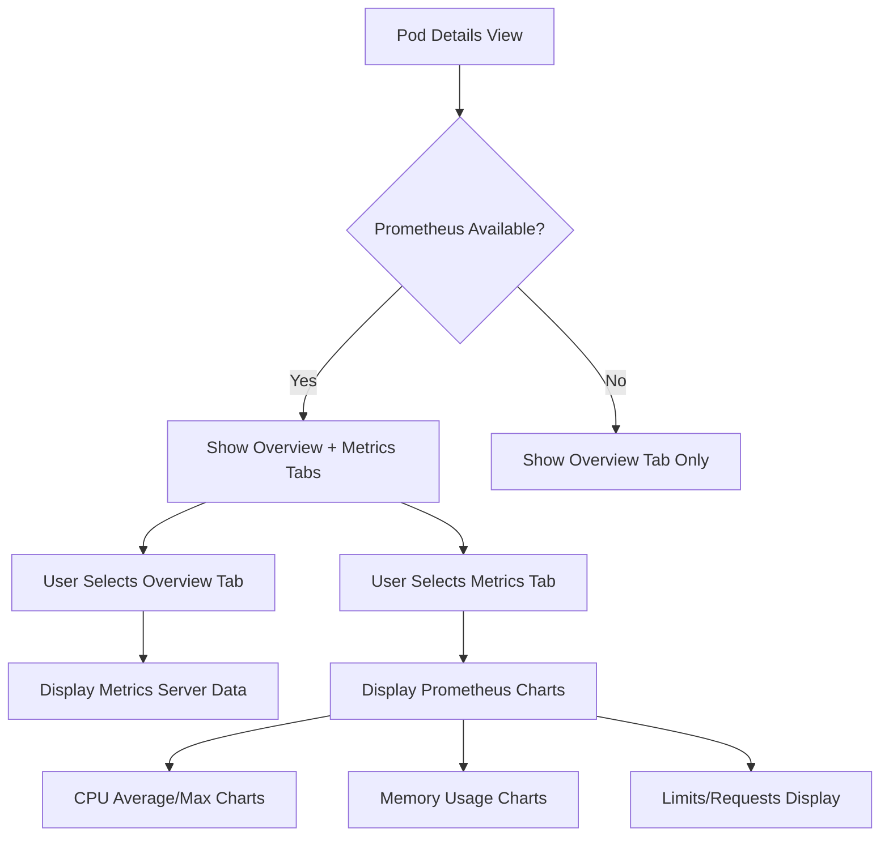

# Pod Metrics Tab - Product Requirements Document

## 1. Product Overview

Implement a new "Metrics" tab within the pod details view that displays advanced Prometheus-based metrics with rich visualizations. This tab provides detailed CPU and memory analytics beyond the basic metrics server data shown in the Overview tab.

The feature enhances monitoring capabilities by offering granular insights into pod resource utilization patterns, helping users identify performance bottlenecks and optimize resource allocation.

## 2. Core Features

### 2.1 User Roles

No specific role distinction is required for this feature. All users with pod viewing permissions can access the Metrics tab when Prometheus is available.

### 2.2 Feature Module

Our pod metrics enhancement consists of the following main components:

1. **Metrics Tab**: Advanced Prometheus-based metrics visualization with CPU and memory charts
2. **Prometheus Detection**: Automatic detection and conditional display based on Prometheus availability
3. **Enhanced Overview Tab**: Existing metrics server integration remains unchanged

### 2.3 Page Details

| Page Name        | Module Name          | Feature description                                                                                                                                                                                                                                       |
| ---------------- | -------------------- | --------------------------------------------------------------------------------------------------------------------------------------------------------------------------------------------------------------------------------------------------------- |
| Pod Details View | Metrics Tab          | Display Prometheus-based CPU metrics including average usage, maximum usage, limits and requests with time-series charts. Show memory usage patterns, limits and requests with visual indicators. Only visible when Prometheus is detected and available. |
| Pod Details View | Overview Tab         | Continue displaying existing metrics server data without modifications. Show basic CPU and memory utilization from Kubernetes metrics server.                                                                                                             |
| Pod Details View | Prometheus Detection | Automatically detect Prometheus availability in the cluster. Conditionally show/hide Metrics tab based on detection results. Handle graceful fallback when Prometheus is unavailable.                                                                     |

## 3. Core Process

**User Flow:**

1. User navigates to pod details view
2. System automatically detects Prometheus availability
3. If Prometheus is available, Metrics tab appears alongside existing tabs
4. User can switch between Overview tab (metrics server data) and Metrics tab (Prometheus data)
5. Metrics tab displays real-time CPU and memory analytics with charts and numerical values
6. If Prometheus becomes unavailable, tab is hidden gracefully

## 4. User Interface Design

### 4.1 Design Style

* **Primary Colors:** Consistent with existing kube-dash theme (blue #3b82f6, purple #8b5cf6)

* **Secondary Colors:** Green for average metrics, yellow for maximum metrics, red for limits, amber for requests

* **Chart Style:** Area charts with gradient fills, similar to existing PodMetricsChart component

* **Layout Style:** Card-based design with clear section separation

* **Typography:** Consistent with existing UI (text-sm for labels, text-xs for values)

* **Icons:** Use existing Radix UI icons for consistency

### 4.2 Page Design Overview

| Page Name        | Module Name          | UI Elements                                                                                                                                                                                                                                                                                                      |
| ---------------- | -------------------- | ---------------------------------------------------------------------------------------------------------------------------------------------------------------------------------------------------------------------------------------------------------------------------------------------------------------- |
| Pod Details View | Metrics Tab          | Card layout with CPU metrics section showing area charts for average/maximum usage over time. Memory metrics section with usage patterns visualization. Sidebar legend showing color coding for different metric types. Reference lines for limits and requests. Responsive grid layout adapting to screen size. |
| Pod Details View | Tab Navigation       | Additional "Metrics" tab button appearing conditionally when Prometheus is detected. Consistent styling with existing Overview, YAML, Events, Logs, and Exec tabs.                                                                                                                                               |
| Pod Details View | Prometheus Detection | No visible UI elements - background detection with graceful handling of availability changes.                                                                                                                                                                                                                    |

### 4.3 Responsiveness

The feature is designed as desktop-first with mobile-adaptive layouts. Charts will resize responsively and legend positioning will adjust for smaller screens. Touch interaction is optimized for mobile chart exploration.

## 5. Technical Requirements

### 5.1 Prometheus Queries

**CPU Metrics:**

* Average CPU Usage: `avg(rate(container_cpu_usage_seconds_total{namespace=~"$namespace",endpoint="https-metrics",pod=~"$pod",image!="", container!="POD"}[2m])* 1000)`

* Maximum CPU Usage: `max(rate(container_cpu_usage_seconds_total{namespace=~"$namespace",endpoint="https-metrics",pod=~"$pod",image!="", container!="POD"}[2m])* 1000)`

**Memory Metrics:**

* Memory usage queries following existing patterns in PodPrometheusChart component

* Container memory working set and limits extraction from pod specifications

### 5.2 Conditional Display Logic

* Utilize existing Prometheus detection mechanism from PrometheusHandler

* Tab visibility controlled by Prometheus availability status

* Graceful degradation when Prometheus becomes unavailable during session

### 5.3 Data Integration

* Leverage existing SSE (Server-Sent Events) infrastructure for real-time updates

* Reuse existing caching mechanisms for performance optimization

* Maintain separation between metrics server data (Overview) and Prometheus data (Metrics)

